  

  <a href="https://github.com/ai4s-research/open-science"><strong>Open Science Desktop</strong></a>
  &nbsp;·&nbsp;
  <a href="https://github.com/ai4s-research/ai4s-skills"><strong>AI4S Skills</strong></a>
  &nbsp;·&nbsp;
  <a href="https://github.com/ai4s-research/awesome-ai-for-science"><strong>Awesome AI for Science</strong></a>
  &nbsp;·&nbsp;
  <a href="https://github.com/ai-boost/awesome-harness-engineering"><strong>Harness Engineering</strong></a>

  
    <a href="https://github.com/ai4s-research">AI4S Research</a>
    &nbsp;·&nbsp;
    <a href="https://x.com/gpt_boost">@gpt_boost</a>
  

